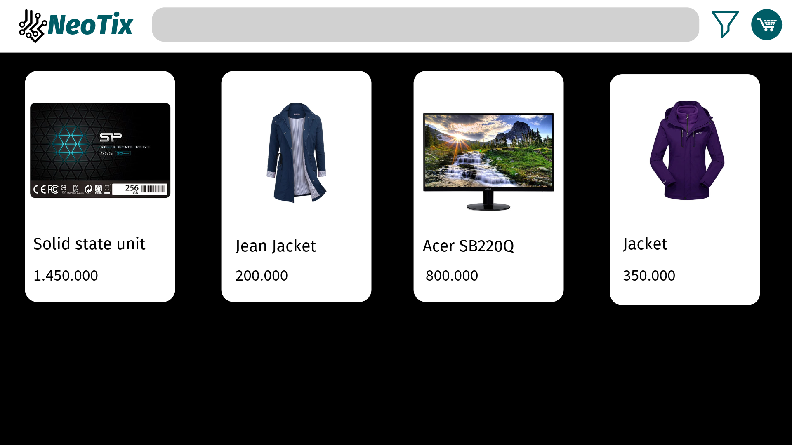
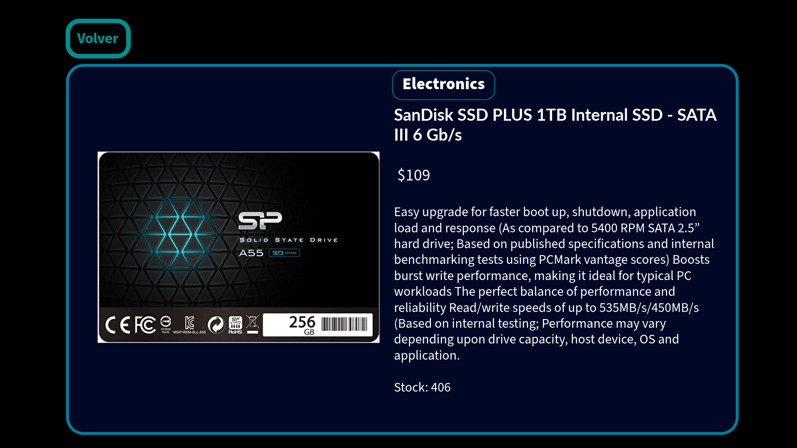

# Maquetación y Estructuración

## Maquetacion y Diseño

### Estructura planeada

En la estructura planeada se quiere implementar 4 paginas, una que sea la index page que es la bienvenida al usuario apenas ingresa al sitio web. En la pagina de compras_page se aparcan todos los productos consultados a la API y son ajustados y posicionados en el grid. En la pagina de detalle_producto se aloja la informacion del producto que se selecciona desde la pagina de compras_home. Finalmente en la pagina de carrito de compras se colocan los productos que son agregados desde la pagina de detalle producto, en el carrito de compras se puede modificar la cantidad de productos solicitados y la suma total.

### Index_page

### Compras_page

### Detalle producto page

### Carrito de compras

