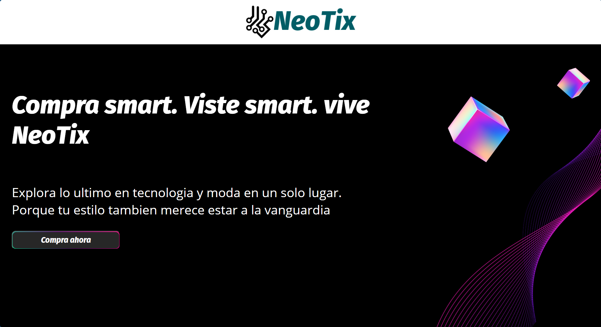
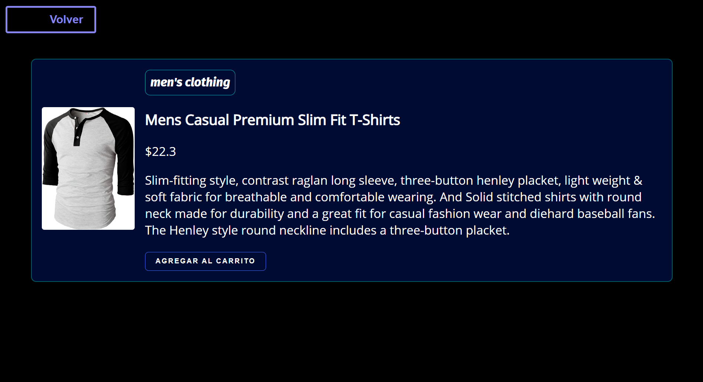

# Bitácora de Diseño y Funcionalidad - NEOTIX

Tablero KanBan | ClickUp

https://app.clickup.com/90131736284/v/li/901314599067

## Planeación

### Estructura planeada


En la estructura planeada se quiere implementar 4 paginas, una que sea la index page que es la bienvenida al usuario apenas ingresa al sitio web. En la pagina de compras_page se aparcan todos los productos consultados a la API y son ajustados y posicionados en el grid. En la pagina de detalle_producto se aloja la informacion del producto que se selecciona desde la pagina de compras_home. Finalmente en la pagina de carrito de compras se colocan los productos que son agregados desde la pagina de detalle producto, en el carrito de compras se puede modificar la cantidad de productos solicitados y la suma total.

### Index_page


🔹 Vista de bienvenida (index.html)

Se implementa una vista inicial que da la bienvenida al usuario con fines de ambientación y presentación general del sitio de compras NeoTix. Esta página incluye un botón principal que permite al usuario acceder a la vista de productos disponibles.

Desde una perspectiva estética y educativa, se integran dos cubos animados que aportan un toque sutil de elegancia y minimalismo, reforzando la identidad visual del proyecto y demostrando el uso de animaciones CSS dentro de una interfaz limpia y moderna.

### Compras_page


🔹 Vista principal de productos (products_page.html)

Esta sección del sitio web permite visualizar dinámicamente todos los productos disponibles mediante el uso de JavaScript. Cada producto es generado desde una fuente externa (API) y puede ser consultado individualmente accediendo a su vista de detalle, también construida de forma dinámica.

La página incluye:

- Una barra de búsqueda para localizar productos por nombre.

- Un filtro por categoría, que se genera automáticamente a partir de los productos obtenidos.

- Un botón de acceso al carrito de compras, donde se visualizan los productos seleccionados por el usuario.

- Un enlace de retorno a la página de bienvenida presionando el logo de NeoTix ubicado en la barra de navegación.

- Esta vista representa el corazón funcional del sitio y centraliza toda la interacción del usuario con los productos.

### Detalle producto page


En esta sección del sitio web se despliega un contenedor con un fondo azul más amplio y destacado, diseñado para resaltar la información específica del producto seleccionado. Esta vista se genera de manera dinámica al hacer clic sobre cualquier producto en la página principal.

### Carrito de compras


🔹 Vista del carrito de compras

En esta sección se muestran todos los productos seleccionados por el usuario para su futura compra. La información del carrito se gestiona utilizando localStorage, lo que permite mantener los productos añadidos incluso si el usuario recarga la página.

El carrito incluye:

- Una lista dinámica de productos añadidos, cada uno con:

- Imagen, nombre y precio unitario.

- Botones para incrementar o reducir la cantidad deseada.

- Un resumen con el total acumulado de la compra.

- Un botón para pagar (funcionalidad no implementada en esta etapa según los requerimientos).

- Un botón para vaciar el carrito completamente.

- Acceso de vuelta a la vista de productos con un botón de “Volver”.

Esta vista está diseñada para ofrecer una experiencia de compra clara, ordenada y flexible, permitiendo al usuario ajustar su pedido fácilmente antes de finalizar.


## Desarrollo de las ramas 

### 🧱 Rama HTML


Rama donde se encuentra toda la estructura html de la pagina web de compras

### ✅ commits relevantes:
<p align="center">  <br/>  </p>

### 🗑️ Justificacion de archivos eliminados:

El desarrollo de los distintos archivos HTML presentes en los commits de esta rama tuvo como objetivo inicial ofrecer múltiples vistas para facilitar la navegación del usuario. No obstante, siguiendo buenas prácticas de desarrollo, se decidió utilizarlos únicamente como referencia estructural durante la implementación de vistas dinámicas con JavaScript, con la excepción del archivo "Products_page.html", donde efectivamente se alojan dichas vistas.

En conclusión, estos archivos fueron creados como guía temporal y posteriormente eliminados al no cumplir una función adicional dentro del proyecto. La versión final del sitio se desarrolló únicamente con dos archivos HTML principales: index.html y Products_page.html.

### Estructura HTML final de index.html:

<p align="center">  <br/> 

🔹 index.html: Archivo encargado de dar la bienvenida al usuario. En esta vista se incluyen elementos decorativos y estéticos que introducen al sitio y refuerzan la identidad visual de la tienda.

### Estructura HTML final de products_page.html:

<p align="center">  <br/> 

Archivo principal que estructura todas las vistas dinámicas del sitio web.
Sirve como contenedor central donde se integran, mediante JavaScript, las siguientes secciones:

🛍️ Vista general de todos los productos

🔎 Vista detallada del producto seleccionado

🛒 Carrito de compras interactivo

Este archivo fue diseñado para trabajar en conjunto con el script functionality.js, evitando la fragmentación del proyecto en múltiples archivos HTML y promoviendo una arquitectura más dinámica, escalable y mantenible.

<hr>

### 🎨 Rama CSS:


Rama que contiene todos los estilos CSS aplicados al sitio web de compras NeoTix. Aquí se definen los aspectos visuales del proyecto, incluyendo:

- Diseño de interfaz y disposición de elementos (maquetación).

- Animaciones sutiles como los cubos en la página de bienvenida.

- Estilos responsivos para adaptar la experiencia a distintos dispositivos.

- Personalización de botones, tarjetas de productos, navegación y carrito de compras.

- El objetivo de esta rama es garantizar una experiencia visual moderna, coherente y atractiva, reforzando la identidad visual del sitio.

### ✅ Commits relevantes:


### Estilos para la index.html:

El objetivo fue captar la atención del usuario desde el inicio y motivarlo a explorar el sitio de forma intuitiva y visualmente estimulante, cuidando tanto la legibilidad como la armonía visual. La distribución de elementos, tipografías y paleta de colores fueron elegidas para mantener coherencia con la identidad de la tienda.

Por motivos estéticos, se implementó la función cubic-bezier para animar los cubos presentes en el diseño de la página principal. Esta elección permitió lograr una transición más fluida, dinámica y personalizada en los elementos decorativos, aportando modernidad y coherencia visual al estilo general del sitio.

- Estilo final de index.html:



### Estilos y distribución en la Products Page:

La página de productos cuenta con una barra de navegación de fondo claro que incluye una barra de búsqueda central y dos íconos (filtro y carrito), diseñados con los mismos colores que el logo de NEOTIX para mantener una coherencia visual.
La distribución de los productos se implementó usando display: grid, acompañado de ajustes personalizados para asegurar su adaptación automática a diferentes tamaños de pantalla, garantizando una experiencia responsive fluida.
Cada tarjeta de producto muestra de forma clara su imagen, nombre y precio, permitiendo al usuario explorar la tienda de manera intuitiva y ordenada.

- Estilo final de products_page:


### Diseño de la vista de detalle del producto

En esta sección se optó por un enfoque simple y minimalista, diseñado para dar total protagonismo al producto. El objetivo fue eliminar distracciones visuales y centrar la atención del usuario en la información esencial.
La tarjeta de detalle muestra de forma clara y jerarquizada todos los datos relevantes: nombre del producto, precio, descripción, categoría e imagen en alta calidad. Esta disposición permite que el usuario pueda tomar decisiones informadas de forma cómoda y rápida.

- Estilo final de la details_page



### Diseño de la vista del carrito de compras

El diseño del carrito de compras mantiene coherencia con la paleta de colores general del sitio, reforzando la identidad visual de NEOTIX. Cada ítem agregado al carrito se presenta en una tarjeta con borde, sombra difusa y una estructura organizada que favorece la legibilidad y la comodidad del usuario.
Los productos se distribuyen verticalmente dentro de un contenedor central, permitiendo identificar fácilmente la imagen, nombre, precio y cantidad. Además, se incluyen botones intuitivos para aumentar o disminuir la cantidad de cada producto.
El encabezado de la vista se adapta para identificar claramente la sección, incorporando un botón de retorno, un ícono representativo del carrito y el título correspondiente, brindando contexto y continuidad al usuario.

- Estilo final para la cart_page:


<hr>

### 🟡 Rama JavaScript


Esta rama está enfocada en implementar las funcionalidades clave de la página web. Entre sus principales características se encuentran:

- 🔍 Búsqueda en tiempo real de productos mediante coincidencia por nombre.

- Filtrado dinámico por categorías obtenidas desde la API.

- Renderizado interactivo de productos, con vista detallada al hacer clic sobre cada uno.

- 🛒 Carrito de compras funcional, que permite:

- 🧮 Agregar productos con su respectiva cantidad.

- ➕ Incrementar o reducir unidades de un producto.

- 🔢 Calcular el total de la compra.

- 🛒 Vaciar el carrito completamente.

- 🗄️ Persistencia del carrito mediante localStorage, incluso al recargar la página.

Toda la lógica fue desarrollada en JavaScript puro, manteniendo el código modular, comentado y organizado para facilitar su comprensión y mantenimiento.

### ✅ Commits relevantes:


### Funcionalidades principales realizadas:

#### Manejo de las vistas:

Como fue mencionado en la rama HTML, el manejo de las vistas dinamicas se realizo por JavaScript manejando solo un arhivo HTML como base para todas las vistas, bien, aqui se trata a detalle: 

Segun el HTML, se capturaron las secciones que iban a ser las vistas de cada funcionalidad y que iban a ser modificadas usando una clase en CSS llamada ".oculto"

```jsx
// Creaciòn de los contenedores para las vistas 
const contenedorProductos = document.getElementById("contenedorProductos");
const detalle = document.getElementById("detalleProducto");
const barraNavegacion = document.querySelector("header.nav_tab");
```

#### Mostrar los productos dinamicamente con JS:

- El sitio web NEOTIX obtiene los productos desde la API brindada:
https://fakestoreapi.com/products

Esto se realiza mediante una función asíncrona que hace una consulta utilizando fetch(), permitiendo esperar la respuesta sin bloquear la ejecución del programa:

```jsx
//Funcion asincrona encargada de cargar los productos desde la API
async function cargarProductos() {
    try {
        //Consulta a la API
        const response = await fetch("https://fakestoreapi.com/products");
        const productos = await response.json();

        //Guarda los productos obtenidos en la variable global `productosTotal`.
        productosTotal = productos;

        //Llama a `mostrarProductos()` para renderizar los productos en pantalla.
        mostrarProductos(productosTotal);
        mostrarCategorias();
    } catch (error) {

        //Mostrar mensaje de error en caso de que falle la consulta
        console.error("Error al cargar los productos:", error);
        const mensaje = document.createElement("p");
        mensaje.textContent = "No se pudieron cargar los productos.";
        contenedorProductos.appendChild(mensaje);
    }
}
```
<br>

Una vez obtenidos los productos desde la API, se utiliza una función específica para renderizarlos dinámicamente en el DOM. Esta función recibe como parámetro el array de productos (productos) y se encarga de:

- Limpiar la vista anterior con replaceChildren().

- Crear un contenedor individual por producto.

- Añadir imagen, nombre y precio al contenedor.

- Insertar cada tarjeta al contenedor principal.

- Utilizar forEach() para recorrer y procesar cada elemento.

```jsx
function mostrarProductos(productos) {
    contenedorProductos.replaceChildren();  // Limpia contenido anterior
    productos.forEach(producto => {
        const contenedorProducto = document.createElement("div"); // Crea contenedorProducto
        contenedorProducto.classList.add("producto");

        // Crea la imagen del producto
        const img = document.createElement("img");
        img.setAttribute("src", producto.image);
        img.setAttribute("alt", producto.title);
        img.classList.add("imagen_producto")

        // Nombre del producto
        const nombre_producto = document.createElement("strong");
        nombre_producto.textContent = producto.title;

        // Precio del producto
        const precio = document.createElement("span");
        precio.textContent = `$${producto.price}`;

        // Armado de la tarjeta del producto
        contenedorProducto.appendChild(img);
        contenedorProducto.appendChild(nombre_producto);
        contenedorProducto.appendChild(precio);

        // Evento que permite mostrar los detalles del producto
        contenedorProducto.addEventListener("click", () => detalleProducto(producto));

        // Agregar al DOM
        contenedorProductos.appendChild(contenedorProducto);
    });
}
```

#### Funciones de filtrado y busqueda desde la barra de navegacion:

Antes de aplicar cualquier lógica funcional, se capturan los elementos clave del DOM que estarán involucrados en los eventos de búsqueda y filtrado. Esto incluye el ícono del filtro, el menú desplegable (select) de categorías y la barra de búsqueda y se le asigan los eventos a cada uno.

```jsx
//Captura de los elementos del filtro, el select y la barra de busqueda
const button_filtro = document.getElementById("filtro_logo");
const menu_filtro = document.getElementById("menu_filtro");
const inputBusqueda = document.getElementById("search_input");

// Asigna la función 'busquedas' como manejadora de eventos para:
// El evento 'input' en el campo de búsqueda (se ejecuta cada vez que el usuario escribe).
inputBusqueda.addEventListener("input", busquedas);

// El evento 'change' en el menú desplegable de categorías (se ejecuta al seleccionar una categoría).
menu_filtro.addEventListener("change", busquedas);

// Asigna un evento al ícono de filtro que alterna (muestra/oculta) el menú desplegable de categorías
// Esto permite que el menú solo se muestre cuando el usuario lo necesita.
button_filtro.addEventListener("click", () => {
    menu_filtro.classList.toggle("oculto");
});
```
<br>

Esta función se encarga de gestionar tanto la barra de búsqueda como el filtro por categoría de forma simultánea. Primero, se captura el valor ingresado en el campo de búsqueda y se transforma a minúsculas para garantizar una comparación insensible a mayúsculas y minúsculas. Luego, se obtiene el valor seleccionado en el menú desplegable de categorías.

A continuación, se utiliza el método .filter() sobre el conjunto total de productos para obtener únicamente aquellos que cumplan ambas condiciones: que el nombre coincida parcial o totalmente con el texto buscado, y que pertenezcan a la categoría seleccionada (o a todas si no hay filtro activo).

```jsx
// Funcion que filtra los productos en base al texto de búsqueda y a la categoría seleccionada.
function busquedas() {
    const inputProducto = inputBusqueda.value.toLowerCase(); // Texto del buscador en minúsculas
    const categoriaSeleccionada = menu_filtro.value; // Categoría elegida en el menú

    const filtrados = productosTotal.filter(producto => {
        const s_nombre = producto.title.toLowerCase().includes(inputProducto); // Coincidencia por nombre
        const s_categoria = categoriaSeleccionada === "todas" || producto.category === categoriaSeleccionada;  // Coincidencia por categoría

        return s_nombre && s_categoria; // Retorna los productos que cumplan con ambas condiciones
    });

    mostrarProductos(filtrados); // Renderiza los productos filtrados
}
```

<br>

#### Funcion para mostrar los detalles de un producto:

Esta función se activa al hacer clic sobre un producto, y se encarga de renderizar una vista detallada del mismo. Primero, limpia la vista principal de productos y oculta la barra de navegación para enfocar al usuario en el producto seleccionado.

A continuación, se crean los contenedores necesarios: uno principal, uno para la imagen y otro para la información del producto. En esta vista se muestra dinámicamente el nombre, precio, descripción, categoría e imagen del producto.

Además, se incorporan dos botones clave:

- Volver: permite regresar a la vista general de productos.

- Agregar al carrito: almacena el producto en localStorage, asegurando persistencia incluso si se recarga la página.

Este enfoque mejora la experiencia del usuario al ofrecer una transición fluida y enfocada entre vistas.

```jsx
function detalleProducto(producto) {

    // Oculta secciones innecesarias y muestra la de detalles
    contenedorProductos.classList.add("oculto");
    detalle.classList.remove("oculto");
    barraNavegacion.classList.add("oculto");

    detalle.replaceChildren(); // Limpia contenido previo

    // Botón volver
    const back_button = document.createElement("button");
    back_button.textContent = "Volver";
    back_button.classList.add("bubbles");
    back_button.addEventListener("click", volver)

    // Contenedor principal
    const contenedor_general = document.createElement("div")
    contenedor_general.classList.add("contenedor_general")

    // Contenedor para la imagen
    const contenedorImagen = document.createElement("section")
    contenedorImagen.classList.add("contenedorImagen")

    const imgDetalle = document.createElement("img");
    imgDetalle.setAttribute("src", producto.image);
    imgDetalle.setAttribute("alt", producto.title);
    imgDetalle.classList.add("imagen_producto_detalle");

    // Contenedor de información
    const contenedorInfoProducto = document.createElement("section");

    const categoria = document.createElement("div");
    categoria.textContent = producto.category;
    categoria.classList.add("categoria");

    const nombre_producto = document.createElement("h3");
    nombre_producto.textContent = producto.title;

    const precio = document.createElement("span");
    precio.textContent = `$${producto.price}`;

    const descripcion = document.createElement("p");
    descripcion.textContent = producto.description;

    const stock = document.createElement("span");
    stock.textContent = producto.count;

    // Botón para agregar al carrito
    const adquirir = document.createElement("button")
    adquirir.id = "button_agregar"
    adquirir.textContent = "Agregar al carrito";

    // Evento que es ejecutado al hacer click en el boton "Agregar al carrito"
    adquirir.addEventListener("click", () => {

        // Recupera el carrito desde localStorage o lo inicializa como arreglo vacío si no existe
        let carrito = JSON.parse(localStorage.getItem("carrito")) || [];

        // Verifica si el producto ya existe en el carrito
        const productoExistente = carrito.find(p => p.id === producto.id);

        if (productoExistente) {
            // Si el producto ya está en el carrito, incrementa su cantidad
            productoExistente.cantidad += 1;
        } else {
            // Si no está, lo agrega con cantidad 1
            carrito.push({
                id: producto.id,
                title: producto.title,
                price: producto.price,
                image: producto.image,
                cantidad: 1
            });
        }

        // Guarda el carrito actualizado en localStorage
        localStorage.setItem("carrito", JSON.stringify(carrito));

        // Cambia el texto del botón para indicar que el producto fue añadido
        adquirir.textContent = "Producto añadido";
        adquirir.disabled = true; // Desactiva el botón para evitar duplicados inmediatos
    });

    const span = document.createElement("span");
    span.classList.add("text");
    span.textContent = "Volver";
    back_button.appendChild(span);

    // Armar la sección informativa
    contenedorInfoProducto.appendChild(categoria);
    contenedorInfoProducto.appendChild(nombre_producto);
    contenedorInfoProducto.appendChild(precio);
    contenedorInfoProducto.appendChild(descripcion);
    contenedorInfoProducto.appendChild(stock);
    contenedorInfoProducto.appendChild(adquirir);
    contenedorImagen.appendChild(imgDetalle);

    // Agregar secciones al contenedor principal
    contenedor_general.appendChild(contenedorImagen);
    contenedor_general.appendChild(contenedorInfoProducto);

    // Insertar todo en el DOM
    detalle.appendChild(back_button);
    detalle.appendChild(contenedor_general);

}
```
La manera en como se implemento el guardado en localStorage fue: 

Concentremonos en esta porcion de codigo: 

```jsx
adquirir.addEventListener("click", () => {

        // Recupera el carrito desde localStorage o lo inicializa como arreglo vacío si no existe
        let carrito = JSON.parse(localStorage.getItem("carrito")) || [];

        // Verifica si el producto ya existe en el carrito
        const productoExistente = carrito.find(p => p.id === producto.id);

        if (productoExistente) {
            // Si el producto ya está en el carrito, incrementa su cantidad
            productoExistente.cantidad += 1;
        } else {
            // Si no está, lo agrega con cantidad 1
            carrito.push({
                id: producto.id,
                title: producto.title,
                price: producto.price,
                image: producto.image,
                cantidad: 1
            });
        }

        // Guarda el carrito actualizado en localStorage
        localStorage.setItem("carrito", JSON.stringify(carrito));
```


