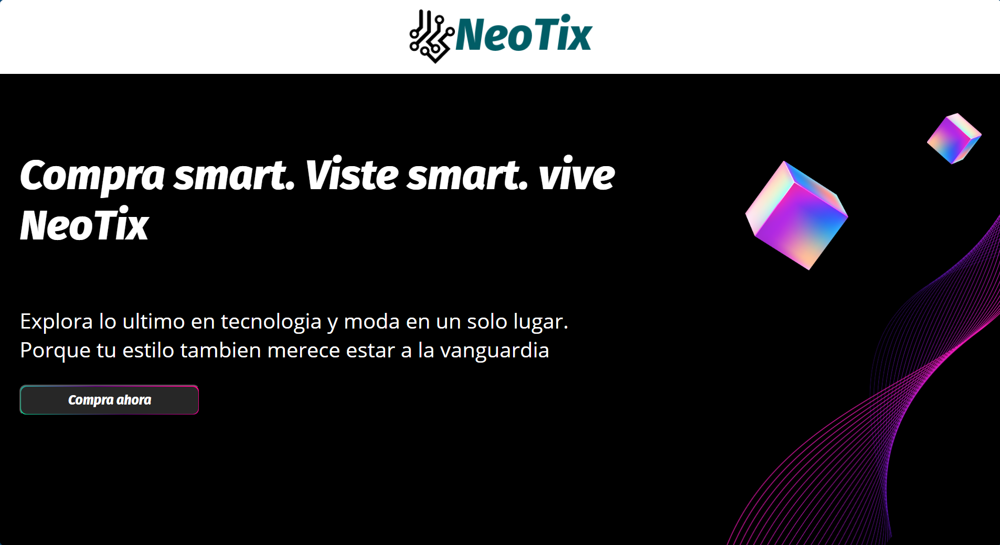
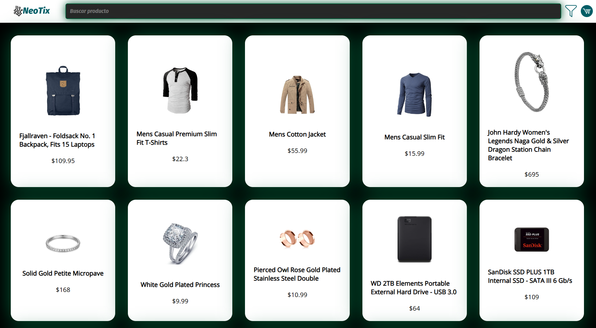
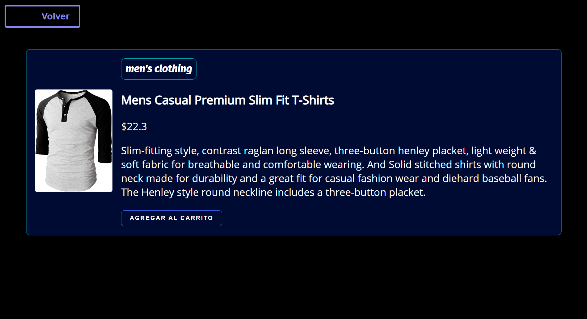
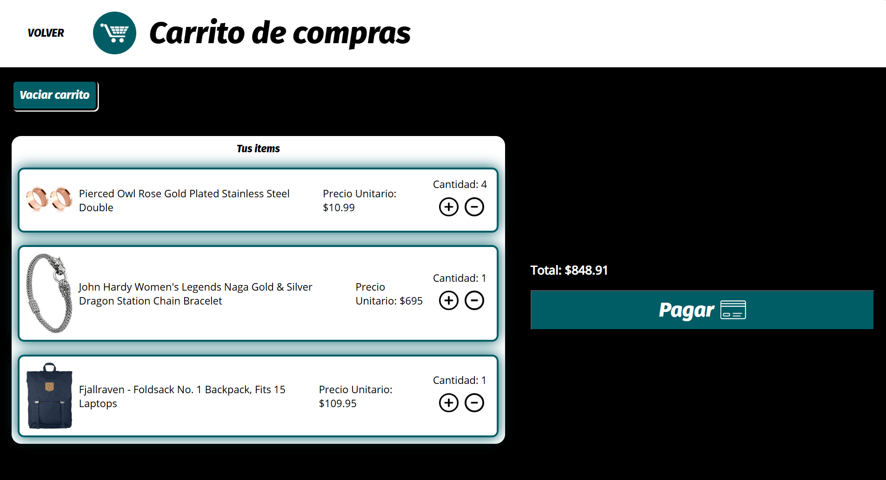

# 🛒 NeoTix - Tienda Virtual Interactiva

Bienvenido a **NeoTix**, una tienda web moderna que permite explorar productos en línea, filtrarlos, buscarlos y agregarlos a un carrito de compras con persistencia de datos. Este proyecto fue desarrollado como parte de un reto académico para implementar una experiencia de compra dinámica y responsiva utilizando JavaScript puro, HTML y CSS.

---

## ✨ Funcionalidades Principales

🛍️ Visualización dinámica de productos desde API

🔍 Búsqueda y filtrado por categoría

🛒 Carrito de compras con incremento de cantidad y total automático

💾 Persistencia del carrito con localStorage

📱 Diseño adaptable a escritorio, tablet y móvil

🧩 Código modularizado con comentarios y funciones reutilizables


## 📸 Vistas de las paginas

### 🎯 Página de inicio (index.html)


### 🛍️ Página de productos


### 📄 Detalle del producto


### 🛒 Carrito de compras


---

## 🚀 Instrucciones para Ejecutar el Proyecto

1. **Clona este repositorio:**
   ```bash
   git clone https://github.com/tu_usuario/NeoTix.git
   cd NeoTix

2. Abre el archivo index.html con tu navegador:

- Puedes abrirlo directamente haciendo doble clic o desde VSCode con la extensión Live Server.

3. Navega por la tienda:

- Usa la barra de búsqueda o el ícono de filtro para explorar productos.

- Haz clic sobre un producto para ver su información detallada.

- Añádelo al carrito y accede a él desde el ícono de carrito en la barra superior.

⚠️ Requiere conexión a Internet para obtener los productos desde https://fakestoreapi.com/products

## 🧠 Tecnologías Usadas

- HTML5 + CSS3 (con diseño responsivo y estética neon/dark)

- JavaScript (DOM dinámico, localStorage, lógica del carrito)

- API pública de FakeStore


## 📌 Estado del Proyecto
✅ 100% funcional

🎨 Estética definida en rama estilos

🧩 Funcionalidad completa en rama funcionalidad

📋 Documentación y análisis disponibles

🗂️ Kanban usado en ClickUp como sistema de organización


## 👨‍💻 Autor
Joan Sebastian Gomez Serrano (Sebas404040)

